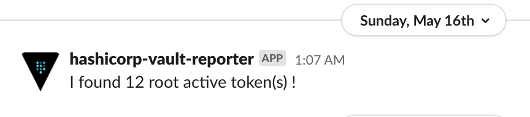
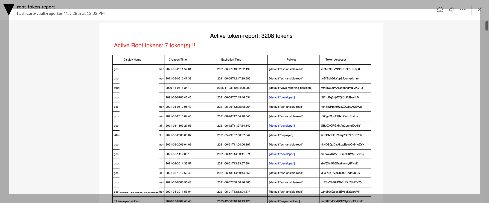

#Hashicorp vault toekn reporter

This project is intended to automatically generate an overview over the active tokens living on your hashicorp vault.
The generated overview has a pdf format and issent to a slack channel that you can configure.

##Prerequisites:

This application is supposed to run as a container in a pod on kubernetes.
The pod should have a k8s service account that is mounted to it.
That service account should be able to connect to hashicorp vault and authenticate with a vault kubernetes backend module.

##Environment variables
The  environment variable you would need  for this to run are:
VAULT_ADDR  #Hashicorp-vault-server address
$KUBERNETES_AUTH_ROLE #The vault's kubernetes backend  auth to allow the vault-reporter pod to connect to vault
$KUBERNETES_AUTH_MOUNTPOINT #The vault's kubernetes backend mountpoint 
REPORTER_SLACK_BEARER #Slack Bearer 
SLACK_CHANNEL #slack channel to submit the pdf to
SLACK_MONITORING_CHANNEL  #Alerts when there is one at least a  root  token

Style:
token posessing vault policies containing "developer", "admin" or root will be shown with a specific style/font

